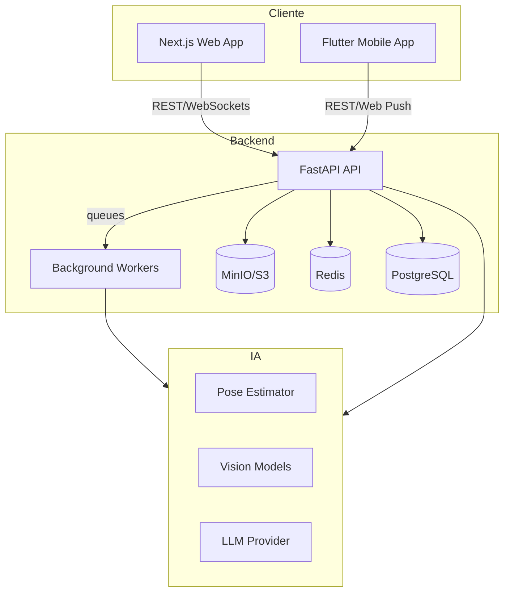

# H-Life Monorepo

H-Life is a holistic health assistant that combines nutrition, training, hydration, biometrics and AI assisted insights across web, mobile and backend services.

## Arquitetura



### Módulos

| Diretório | Descrição | Documentação |
|-----------|-----------|---------------|
| `backend/` | API FastAPI, banco, IA e integrações | [docs/backend.md](docs/backend.md) |
| `frontend/` | Aplicação web Next.js (PWA + push) | [docs/frontend.md](docs/frontend.md) |
| `mobile/` | Aplicativo Flutter com integrações de câmera/notificações | [docs/mobile.md](docs/mobile.md) |
| `docs/` | Diagramas, referências de dados e políticas | [docs/README.md](docs/README.md) |

## Requisitos

- Docker 24+
- Docker Compose v2
- Node.js 20+ (para desenvolvimento do front)
- pnpm 8+
- Flutter 3.16+
- Python 3.11+
- Poetry 1.6+

## Setup de Desenvolvimento

1. Clone o repositório e copie os arquivos `.env`:
   ```bash
   git clone https://example.com/H-Life.git
   cd H-Life
   cp backend/.env.example backend/.env
   cp frontend/.env.local.example frontend/.env.local
   cp mobile/env.dev.example mobile/.env.dev
   ```
2. Suba os serviços de infraestrutura:
   ```bash
   cd backend
   docker compose up -d postgres redis minio
   ```
3. Instale as dependências do backend e rode as migrations:
   ```bash
   poetry install
   poetry run alembic upgrade head
   ```
4. Execute o backend:
   ```bash
   poetry run uvicorn app.main:app --reload
   ```
5. Em outro terminal, inicialize o front-end:
   ```bash
   cd ../frontend
   pnpm install
   pnpm dev
   ```
6. Para o aplicativo móvel, utilize o flavor `dev`:
   ```bash
   cd ../mobile
   flutter pub get
   flutter run --flavor dev -t lib/main_dev.dart
   ```

## Scripts

| Área | Comando | Descrição |
|------|---------|-----------|
| Backend | `poetry run uvicorn app.main:app --reload` | Executa a API em modo dev |
| Backend | `poetry run pytest` | Testes unitários/integração |
| Backend | `poetry run coverage run -m pytest` | Cobertura |
| Backend | `docker compose up` | Sobe toda a stack (API + infra) |
| Frontend | `pnpm dev` | Servidor Next.js |
| Frontend | `pnpm test` | Testes do front |
| Frontend | `pnpm lint` | Linting |
| Mobile | `flutter test` | Testes Flutter |
| Mobile | `flutter build apk --flavor prod` | Build Android |
| Mobile | `flutter build ios --flavor prod` | Build iOS |

## Documentação por Módulo

- [Backend](docs/backend.md)
- [Frontend Web](docs/frontend.md)
- [Mobile](docs/mobile.md)
- [Fluxos de IA & Dados](docs/ai.md)
- [Segurança e LGPD](docs/security.md)
- [DevOps & Qualidade](docs/devops.md)
- [Lançamento](docs/launch.md)
- [Lacunas de Produto](docs/gap_analysis.md)

## Licença

Este projeto é disponibilizado sob a [licença MIT](LICENSE).
