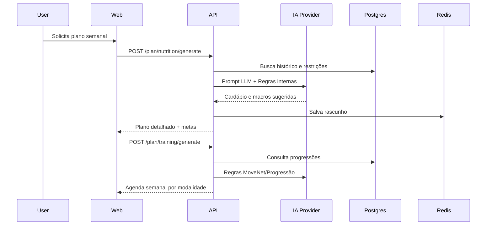
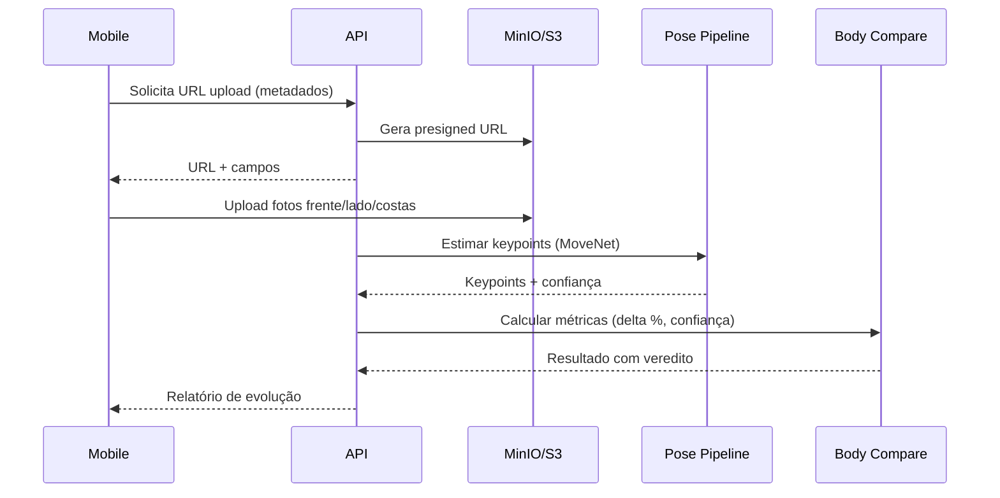

# Fluxos Principais

## Geração de Dieta/Treino



## Lista de Compras

```mermaid
flowchart TD
    A[Plano Nutricional] --> B[Normalizar porção]
    B --> C[Converter unidade (xícara -> g)]
    C --> D[Ajustar cru/cozido]
    D --> E[Aplicar rendimento/desperdício]
    E --> F[Somar por categoria]
    F --> G[Gerar checklist com quantidades]
```

## Evolução Corporal


